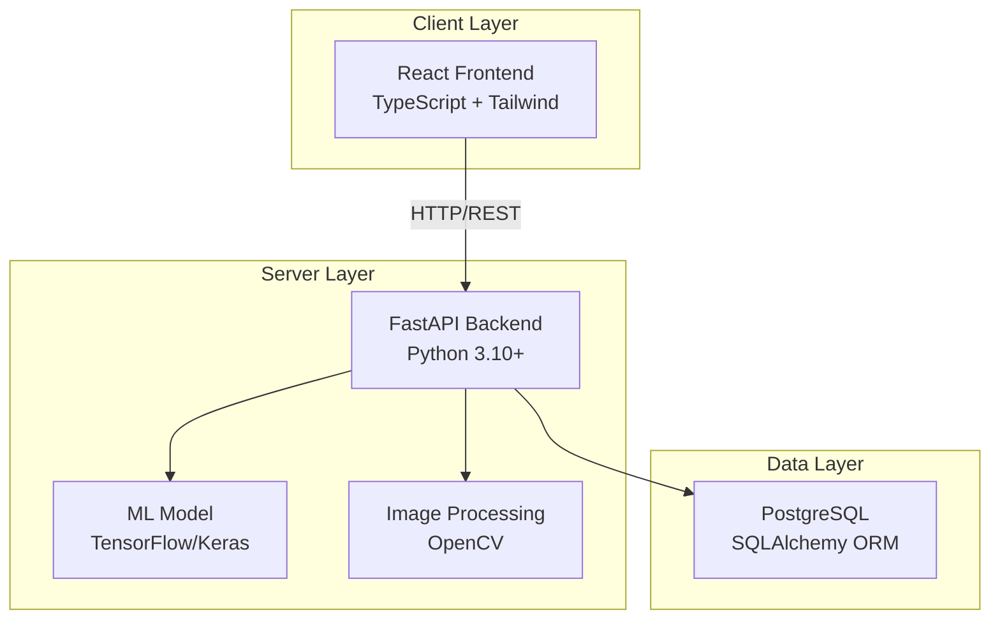
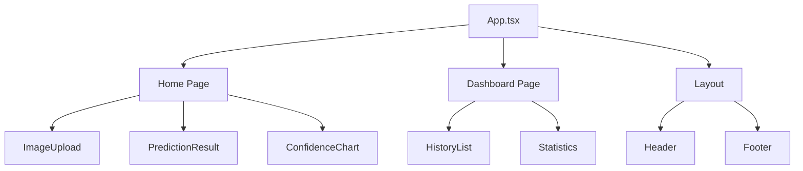
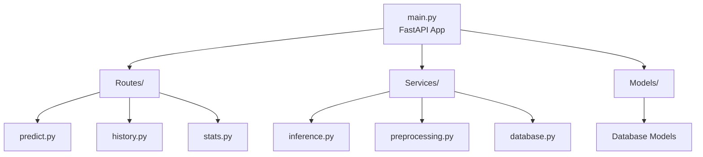
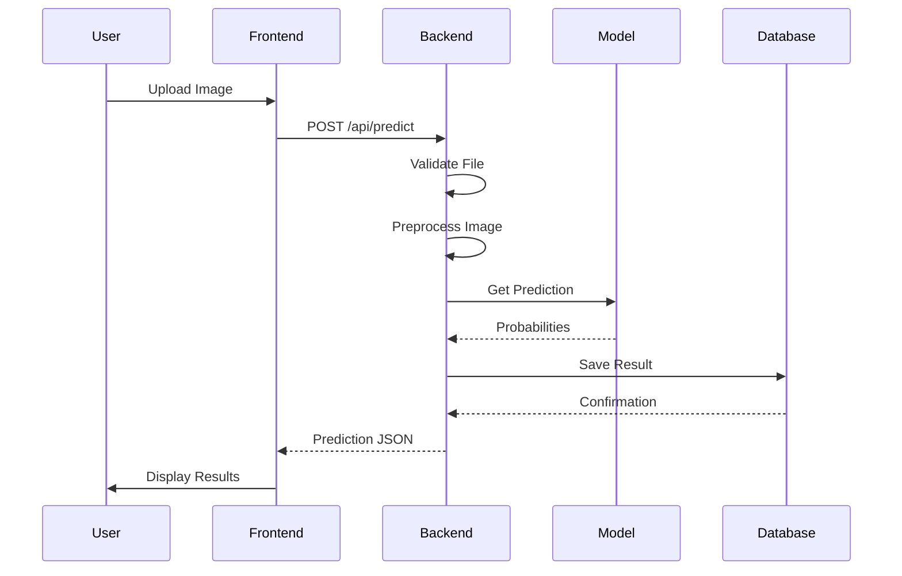
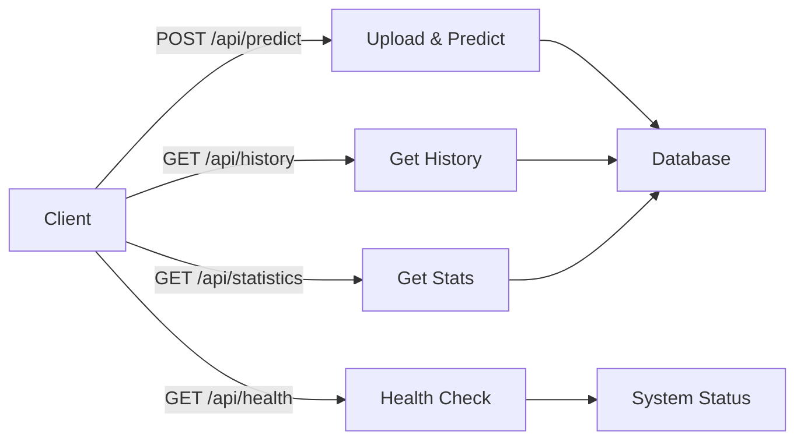
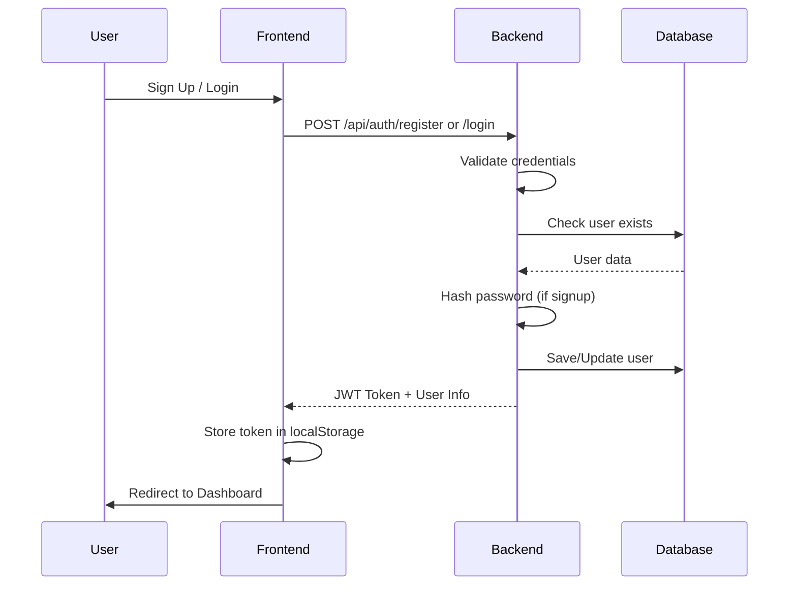
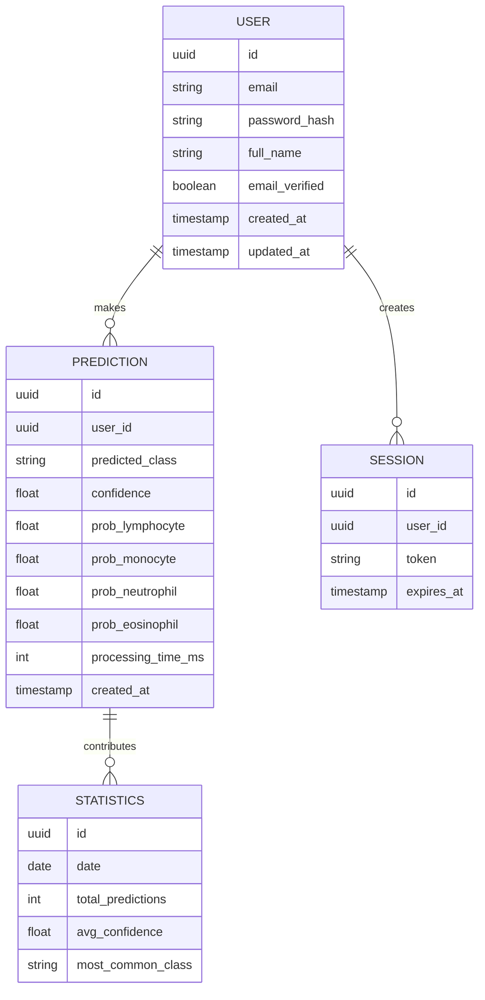
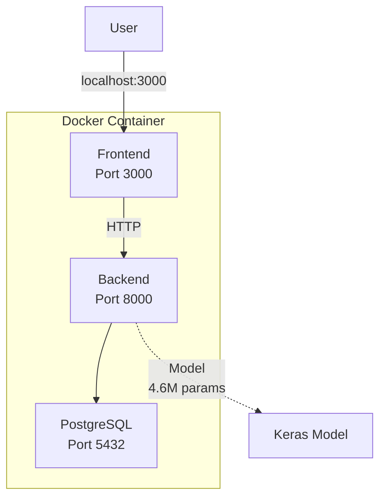

# System Architecture

Technical architecture of the Blood Cell Classification System.

---

## Overview

3-tier architecture with frontend, backend, and database layers.

---

## Component Architecture

### Frontend Components

### Backend Structure

---

## Data Flow

---

## Technology Stack

- **Frontend**: React 18.2, TypeScript, Tailwind CSS, Axios
- **Backend**: FastAPI, Python 3.10+, Pydantic
- **ML**: TensorFlow 2.14, Keras, OpenCV
- **Database**: PostgreSQL, SQLAlchemy ORM
- **DevOps**: Docker, Docker Compose

---

## API Endpoints

---

## Authentication Flow

---

## Database Schema

---

## Deployment

---